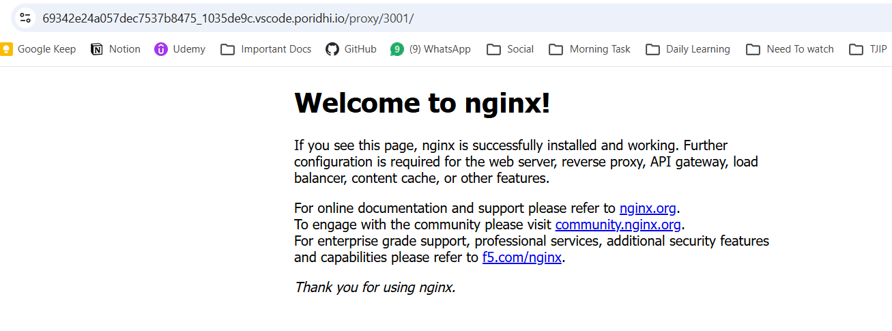
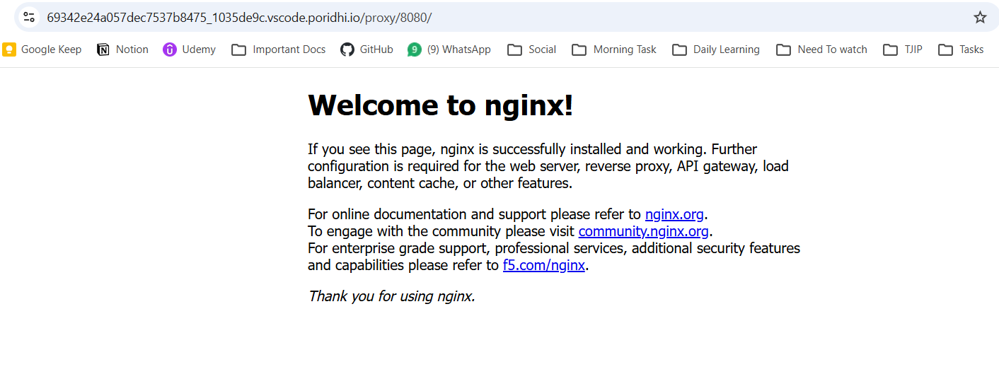
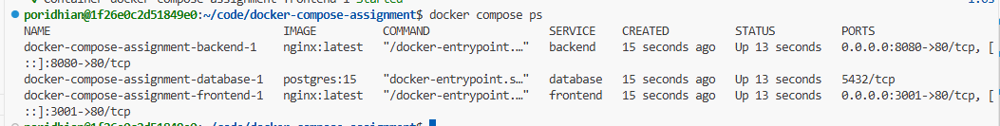
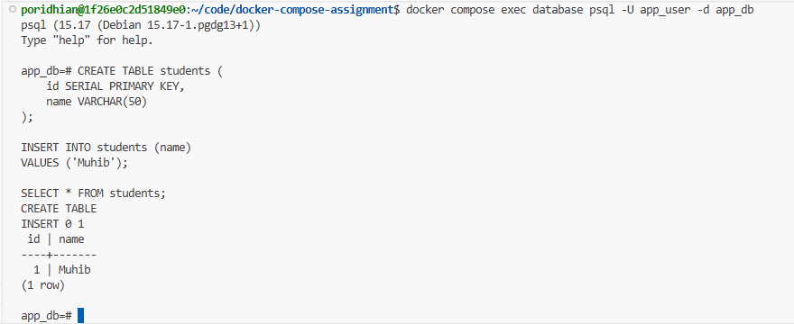
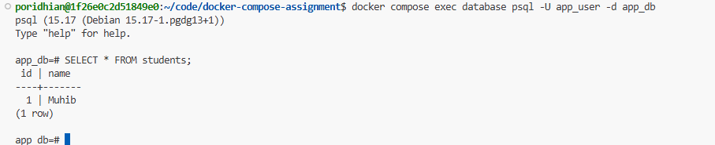
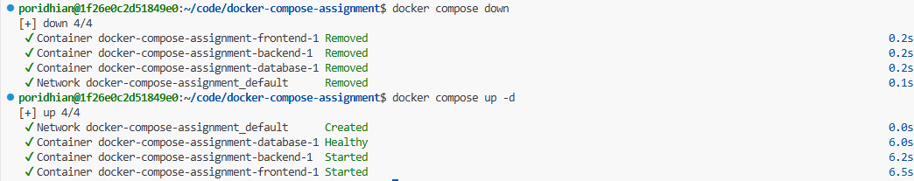
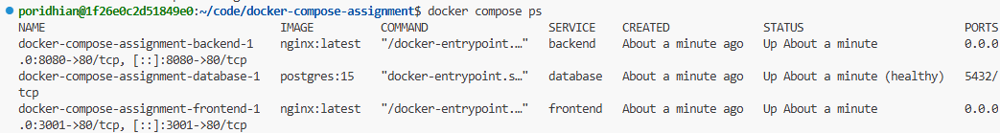
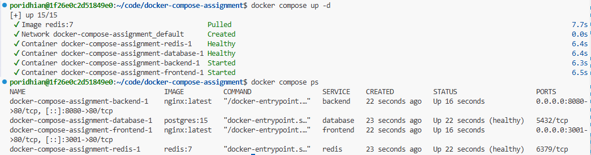
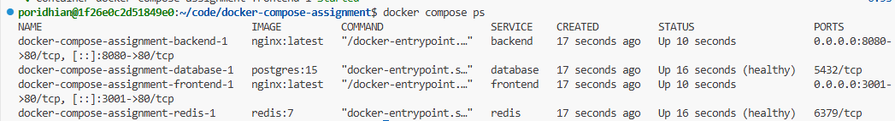
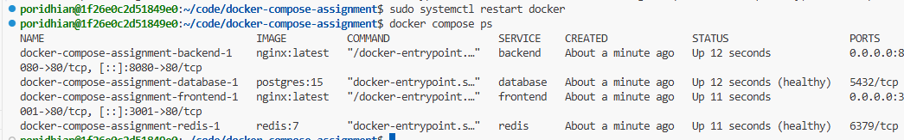

# Docker Compose Assignment

This assignment builds a small multi-service application step by step using Docker Compose.

## Services Used

- Backend: Nginx
- Frontend: Nginx
- Database: PostgreSQL
- Cache: Redis

## Challenge 1: Launch the Basic App

In this challenge, I created two services:

- `backend` using `nginx:latest`, exposed on host port `8080`
- `frontend` using `nginx:latest`, exposed on host port `3001`

The frontend depends on the backend, so it starts after the backend.

> **Note:** In the Poridhi lab environment, port `3000` was already occupied by an internal Node.js process. Therefore, port `3001` was used for the frontend service instead.

<!-- Docker PS -->


<!-- Frontend -->



<!-- Backend -->



## Challenge 2: Add a Database

In this challenge, I added a PostgreSQL database service using the `postgres:15` image.

The database uses environment variables for:

- Username: `app_user`
- Password: `app_password`
- Database name: `app_db`

The backend service depends on the database service, so the backend starts after the database container starts.


## Challenge 3: Database Persistence

In this challenge, I added a named Docker volume to PostgreSQL so that database data remains persistent even after containers are removed.

Volume used:

- `postgres_data`

Mount location inside container:

- `/var/lib/postgresql/data`

To verify persistence, I:

1. Created a sample table
2. Inserted test data
   
3. Removed containers using `docker compose down`
   
4. Started containers again
   
5. Verified that the data still existed
   

## Challenge 4: Wait Until Database Is Ready

In this challenge, I added a health check for PostgreSQL using the `pg_isready` command.

This ensures that the backend service waits until PostgreSQL is fully ready and accepting connections before starting.

Health check configuration:


- Command: `pg_isready`
- Interval: `5s`
- Timeout: `5s`
- Retries: `5`
  
  The backend service now depends on the database service being healthy instead of only waiting for the container to start.

## Challenge 5: Add Redis for Caching

In this challenge, I added a Redis caching service using the `redis:7` image.

A Redis health check was added using:

```bash
redis-cli ping
```

The backend service now waits until both:

- PostgreSQL is healthy
- Redis is healthy
  

## Challenge 6: Survive Docker Restart

In this challenge, I configured automatic container recovery using:

```yaml
restart: unless-stopped
```


This ensures that all services automatically restart after:

- Docker daemon restart
- System reboot
  
