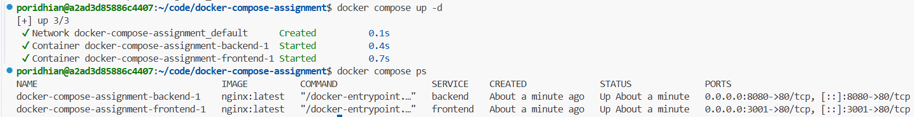
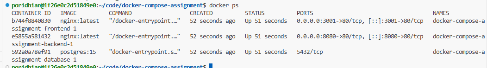

# Docker Compose Assignment

This assignment builds a small multi-service application step by step using Docker Compose.

## Services Used

- Backend: Nginx
- Frontend: Nginx
- Database: PostgreSQL
- Cache: Redis

## Challenge 1: Launch the Basic App

In this challenge, I created two services:

- `backend` using `nginx:latest`, exposed on host port `8080`
- `frontend` using `nginx:latest`, exposed on host port `3000`

The frontend depends on the backend, so it starts after the backend.

# Note: In the lab environment, port 3000 was already occupied by an internal Node.js process. Therefore, port 3001 was used for the frontend service instead.

<!-- Docker PS -->

<!-- Frontend -->

<!-- Backend -->

## Challenge 2: Add a Database

In this challenge, I added a PostgreSQL database service using the `postgres:15` image.

The database uses environment variables for:

- Username: `app_user`
- Password: `app_password`
- Database name: `app_db`

The backend service depends on the database service, so the backend starts after the database container starts.

Note: The frontend uses port `3001` instead of `3000` because port `3000` was already occupied in the Poridhi lab environment.

